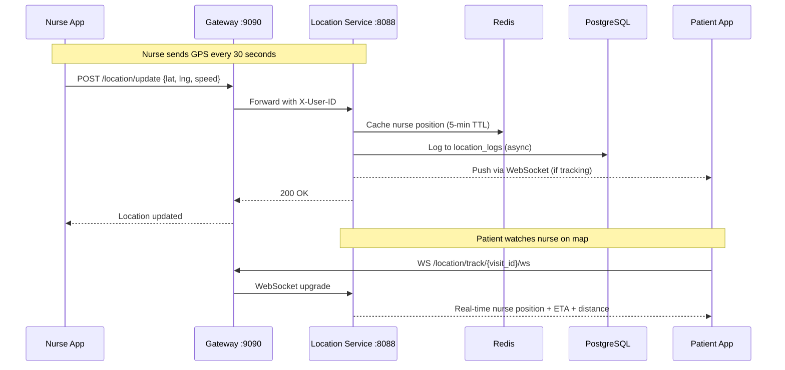
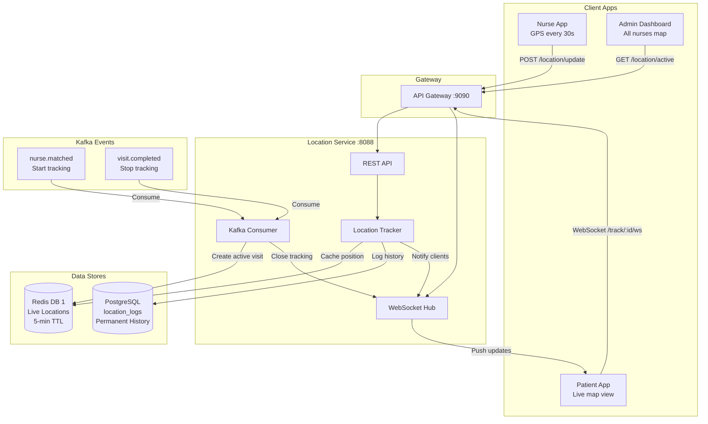
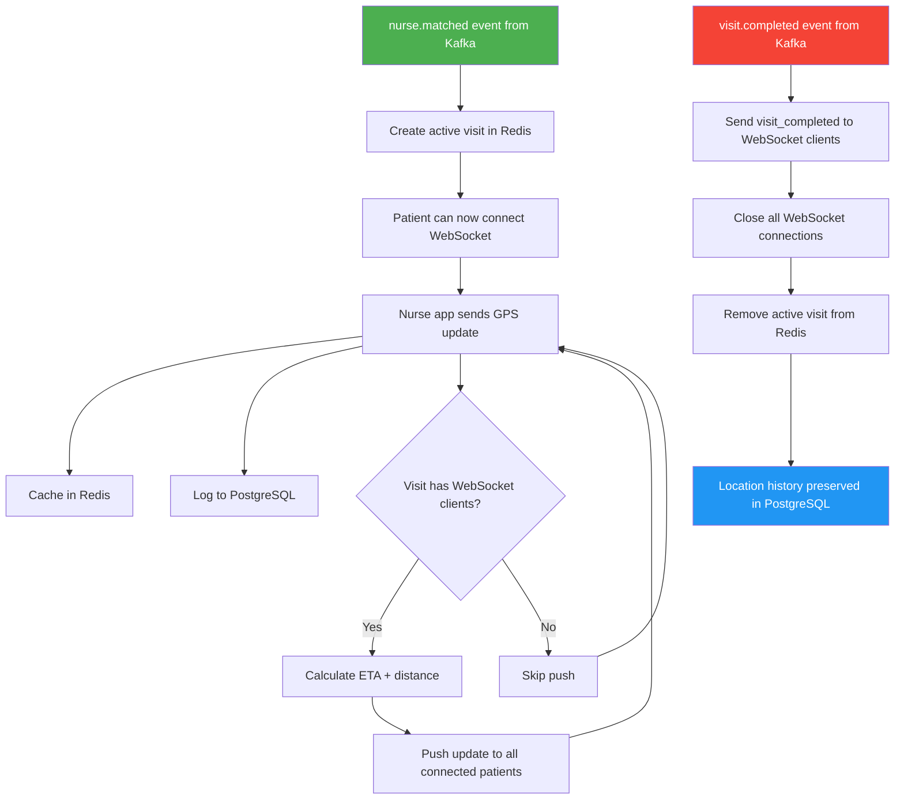
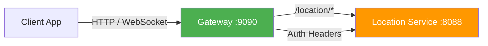
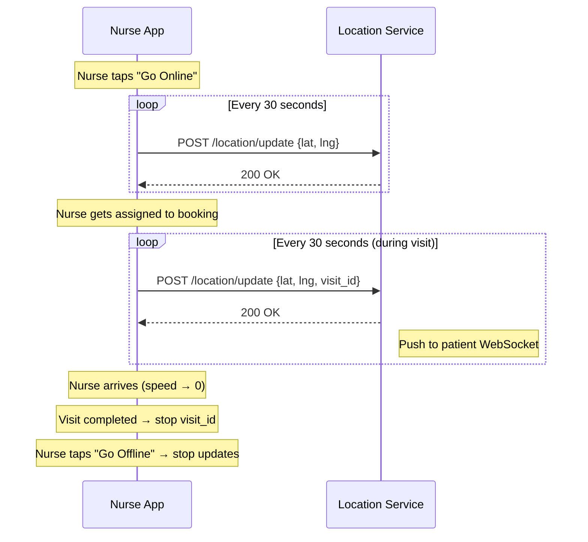
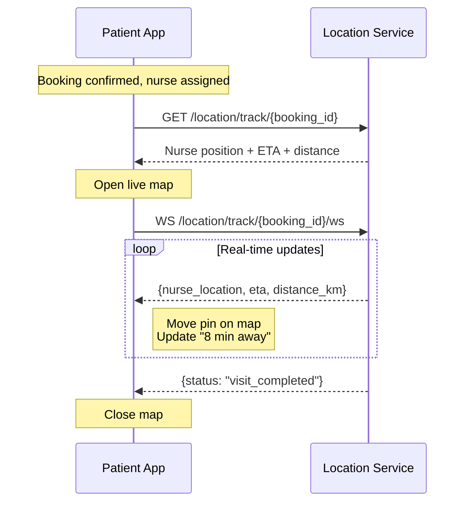
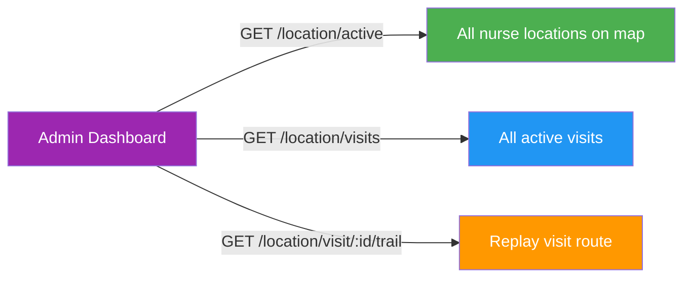

# NAKI Location Tracking Service

Real-time nurse location tracking for the NAKI platform. Manages live GPS updates from nurses, patient-side nurse tracking during active visits, visit movement trails, and admin live map view. Uses Redis for real-time location cache and PostgreSQL for historical location logs.

## How It Works

### Location Flow



### Architecture Overview



### Visit Tracking Lifecycle



### Step-by-Step

1. **Dispatch matches nurse to booking** → `nurse.matched` Kafka event received
2. **Location service creates an active visit** in Redis with patient coordinates
3. **Nurse app starts sending GPS** every 30 seconds via `POST /location/update`
4. **Each update:**
   - Stored in Redis (5-min TTL, overwritten each time)
   - Logged to PostgreSQL (permanent history)
   - Pushed to all connected WebSocket clients watching this visit
5. **Patient opens tracking screen** → connects via WebSocket to `/track/:visit_id/ws`
6. **Patient sees nurse moving** in real-time — each GPS update pushed automatically
7. **Visit completed** → `visit.completed` Kafka event received → WebSocket clients disconnected, active visit removed

---

## Real-Time Tracking (WebSocket)

Patients track their nurse in real-time using WebSocket connections.

### Connection

```
ws://server:9090/location/api/v1/location/track/{visit_id}/ws
```

Headers: `Authorization: Bearer {jwt_token}`

### Messages Received

**Location update (pushed every time nurse moves):**
```json
{
  "nurse_location": {
    "nurse_id": "uuid",
    "latitude": 5.6180,
    "longitude": -0.1950,
    "heading": 45.0,
    "speed": 32.5,
    "visit_id": "booking-uuid",
    "updated_at": "2026-06-20T11:30:00Z"
  },
  "visit": {
    "visit_id": "booking-uuid",
    "nurse_id": "uuid",
    "patient_lat": 5.6225,
    "patient_lng": -0.1880,
    "patient_name": "Kwame Mensah",
    "service_type": "home_care",
    "started_at": "2026-06-20T11:00:00Z"
  },
  "eta": "8 minutes",
  "distance_km": 3.24
}
```

**Visit completed (final message before disconnect):**
```json
{
  "status": "visit_completed",
  "visit_id": "booking-uuid"
}
```

### How ETA is Calculated

- If nurse speed > 5 km/h → `ETA = distance / speed × 60 minutes`
- If nurse speed < 5 km/h (stationary/walking) → assumes 30 km/h city driving

---

## Redis Data Store

Uses Redis DB 1 (dispatch service uses DB 0) to avoid key collisions.

### Key Structure

| Key Pattern | TTL | Purpose |
|-------------|-----|---------|
| `location:nurse:{nurse_id}` | 5 min | Latest GPS position of a nurse |
| `location:visit:{visit_id}` | 4 hours | Active visit context (patient location, nurse assignment) |
| `location:nurse_visit:{nurse_id}` | 4 hours | Maps nurse → their active visit ID |

### Nurse Location Payload

```json
{
  "nurse_id": "uuid",
  "latitude": 5.6180,
  "longitude": -0.1950,
  "heading": 45.0,
  "speed": 32.5,
  "visit_id": "booking-uuid",
  "updated_at": "2026-06-20T11:30:00Z"
}
```

### Active Visit Payload

```json
{
  "visit_id": "booking-uuid",
  "booking_id": "booking-uuid",
  "nurse_id": "uuid",
  "customer_id": "uuid",
  "patient_lat": 5.6225,
  "patient_lng": -0.1880,
  "patient_name": "Kwame Mensah",
  "patient_phone": "+233541234567",
  "service_type": "home_care",
  "started_at": "2026-06-20T11:00:00Z"
}
```

### TTL Strategy

- **Nurse location: 5 min** — if the app stops sending updates (crash, offline, battery dead), the nurse disappears from the map after 5 minutes. Each update resets the TTL.
- **Active visit: 4 hours** — visits can last several hours. Cleaned up by `visit.completed` Kafka event.

---

## Kafka Events

### Consumed Events

| Topic | Source | Purpose |
|-------|--------|---------|
| `nurse.matched` | Dispatch Service | Creates an active visit — starts tracking |
| `visit.completed` | Booking Service | Ends an active visit — stops tracking |

### nurse.matched → Creates Active Visit

When dispatch assigns a nurse to a booking, the location service creates an active visit in Redis. This lets patients track the nurse from the moment they're assigned.

### visit.completed → Stops Tracking

When the booking is completed:
1. All WebSocket clients watching this visit receive a `visit_completed` message
2. WebSocket connections are closed
3. Active visit is removed from Redis
4. Location history remains in PostgreSQL

---

## API Endpoints

### Nurse Location Updates

#### `POST /api/v1/location/update`
Nurse pushes their GPS coordinates. Called every 30 seconds by the nurse app while online or during a visit.

**Role:** `nurse`

**Request:**
```json
{
  "latitude": 5.6180,
  "longitude": -0.1950,
  "heading": 45.0,
  "speed": 32.5,
  "visit_id": "booking-uuid"
}
```

`visit_id` is optional — include it when the nurse is actively heading to or at a patient's location.

**Response:**
```json
{
  "status": 200,
  "message": "location updated"
}
```

---

#### `GET /api/v1/location/nurse/:nurse_id`
Get a nurse's current location from Redis.

**Role:** `nurse`, `customer`, `super_admin`

**Response:**
```json
{
  "status": 200,
  "message": "nurse location retrieved",
  "data": {
    "nurse_id": "uuid",
    "latitude": 5.6180,
    "longitude": -0.1950,
    "heading": 45.0,
    "speed": 32.5,
    "visit_id": "booking-uuid",
    "updated_at": "2026-06-20T11:30:00Z"
  }
}
```

---

### Patient Tracking

#### `GET /api/v1/location/track/:visit_id`
Get current tracking info for an active visit (HTTP polling alternative to WebSocket).

**Role:** `nurse`, `customer`, `super_admin`

**Response:**
```json
{
  "status": 200,
  "message": "tracking info retrieved",
  "data": {
    "nurse_location": { "latitude": 5.6180, "longitude": -0.1950, "..." : "..." },
    "visit": { "patient_name": "Kwame Mensah", "..." : "..." },
    "eta": "8 minutes",
    "distance_km": 3.24
  }
}
```

---

#### `GET /api/v1/location/track/:visit_id/ws`
WebSocket endpoint for real-time tracking. See [Real-Time Tracking](#real-time-tracking-websocket) section above.

---

### Admin Endpoints

#### `GET /api/v1/location/active`
Get all currently active nurse locations (admin live map view).

**Role:** `super_admin`

**Response:**
```json
{
  "status": 200,
  "message": "active nurse locations retrieved",
  "data": [
    { "nurse_id": "uuid", "latitude": 5.6180, "longitude": -0.1950, "..." : "..." }
  ],
  "count": 12
}
```

---

#### `GET /api/v1/location/visits`
Get all currently active visits.

**Role:** `super_admin`

**Response:**
```json
{
  "status": 200,
  "message": "active visits retrieved",
  "data": [
    { "visit_id": "uuid", "nurse_id": "uuid", "patient_name": "Kwame Mensah", "..." : "..." }
  ],
  "count": 5
}
```

---

### Location History

#### `GET /api/v1/location/history/:nurse_id`
Get a nurse's last 100 location logs from PostgreSQL.

**Role:** `nurse`, `super_admin`

**Response:**
```json
{
  "status": 200,
  "message": "location history retrieved",
  "data": [
    {
      "id": "uuid",
      "nurse_id": "uuid",
      "visit_id": "booking-uuid",
      "latitude": 5.6180,
      "longitude": -0.1950,
      "heading": 45.0,
      "speed": 32.5,
      "created_at": "2026-06-20T11:30:00Z"
    }
  ]
}
```

---

#### `GET /api/v1/location/visit/:visit_id/trail`
Get the full GPS trail for a specific visit — every location point the nurse recorded during that visit, in chronological order. Useful for route replay.

**Role:** `nurse`, `customer`, `super_admin`

**Response:**
```json
{
  "status": 200,
  "message": "visit trail retrieved",
  "data": [
    { "latitude": 5.6100, "longitude": -0.2050, "speed": 35.0, "created_at": "2026-06-20T11:00:00Z" },
    { "latitude": 5.6120, "longitude": -0.2020, "speed": 30.0, "created_at": "2026-06-20T11:00:30Z" },
    { "latitude": 5.6150, "longitude": -0.1980, "speed": 28.0, "created_at": "2026-06-20T11:01:00Z" }
  ],
  "count": 3
}
```

---

## Database Schema

### `location_logs` Table

Permanent historical record of all GPS updates.

```sql
CREATE TABLE location_logs (
    id         UUID PRIMARY KEY DEFAULT uuid_generate_v4(),
    nurse_id   UUID NOT NULL,
    visit_id   VARCHAR(100),          -- NULL when nurse is online but not on a visit
    latitude   DECIMAL(10,7) NOT NULL,
    longitude  DECIMAL(10,7) NOT NULL,
    heading    DECIMAL(6,2) DEFAULT 0, -- compass degrees (0-360)
    speed      DECIMAL(6,2) DEFAULT 0, -- km/h
    created_at TIMESTAMPTZ DEFAULT NOW()
);
```

**Indexes:** `nurse_id`, `visit_id`, `created_at`, composite `(nurse_id, created_at DESC)`.

---

## Project Structure

```
naki-location-service/
├── main.go                              # Entry point
├── conf/
│   └── config.go                        # Environment config
├── controllers/
│   └── location.go                      # HTTP handlers
├── database/
│   ├── db.go                            # PostgreSQL connection + migrations
│   └── migrations/
│       └── 001_create_location_logs.sql
├── functions/
│   └── api_functions/
│       ├── redis_store.go               # Redis CRUD for locations + visits
│       ├── location_tracker.go          # Update processing, history, ETA
│       ├── kafka_consumer.go            # nurse.matched + visit.completed listeners
│       └── websocket.go                 # WebSocket hub for live tracking
├── models/
│   └── location.go                      # Data structures
├── routers/
│   └── router.go                        # Route definitions
├── transport/
│   └── middlewares/
│       └── auth.go                      # JWT + gateway header auth
├── Dockerfile
├── .env.example
├── go.mod
└── go.sum
```

---

## Infrastructure

| Service | Purpose | Container |
|---------|---------|-----------|
| **PostgreSQL 16** | Location history logs | `location_postgres` |
| **Redis 7** | Real-time location cache (DB 1) | `naki_redis` (shared) |
| **Kafka** | Event bus (nurse.matched, visit.completed) | `naki_kafka` (shared) |

### Docker Compose

```yaml
location:
  build: ./naki-location-service
  container_name: naki_location
  depends_on:
    location-postgres:
      condition: service_healthy
    redis:
      condition: service_started
    kafka:
      condition: service_started
  environment:
    PORT: 8088
    DB_HOST: location-postgres
    DB_PORT: 5432
    DB_USER: postgres
    DB_PASSWORD: postgres
    DB_NAME: naki_location
    REDIS_ADDR: redis:6379
    KAFKA_BROKER: kafka:9092
    JWT_SECRET: ${JWT_SECRET}
```

### Gateway Routing



---

## Environment Variables

| Variable | Default | Description |
|----------|---------|-------------|
| `PORT` | `8088` | HTTP server port |
| `DB_HOST` | `localhost` | PostgreSQL host |
| `DB_PORT` | `5432` | PostgreSQL port |
| `DB_USER` | `postgres` | PostgreSQL user |
| `DB_PASSWORD` | — | PostgreSQL password |
| `DB_NAME` | `naki_location` | PostgreSQL database name |
| `DB_SSLMODE` | `disable` | PostgreSQL SSL mode |
| `REDIS_ADDR` | `redis:6379` | Redis address |
| `REDIS_PASSWORD` | — | Redis password |
| `KAFKA_BROKER` | `kafka:9092` | Kafka broker address |
| `JWT_SECRET` | — | JWT signing secret |

---

## How the Apps Integrate

### Nurse App Flow



### Patient App Flow



### Admin Dashboard Flow


